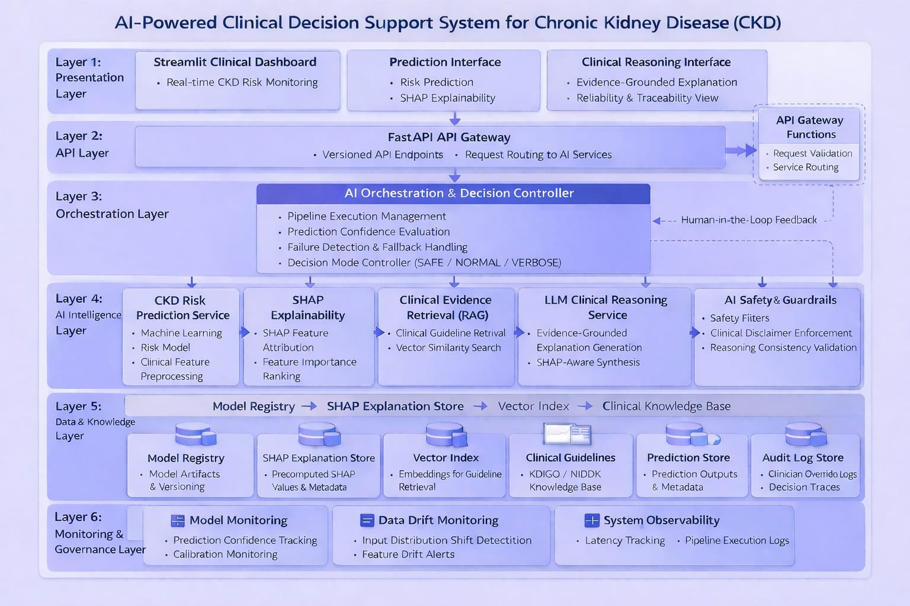

# AI-Powered Clinical Decision Support System for Chronic Kidney Disease (CKD)


An **Explainable AI Clinical Decision Support System** for Chronic Kidney Disease (CKD) that combines machine learning prediction, SHAP explainability, clinical evidence retrieval, and LLM-based reasoning to provide transparent and reliable clinical insights.

The system integrates **ML predictions, explainability, retrieval-augmented reasoning, safety guardrails, and monitoring** to support clinicians with interpretable decision support.

---

# Overview

Chronic Kidney Disease (CKD) requires early risk detection and transparent clinical decision support. Traditional machine learning models often provide predictions without clear reasoning, limiting their usefulness in real-world clinical settings.

This project implements a **layered AI clinical decision support system** that:

- Predicts CKD risk using machine learning models
- Explains predictions using SHAP feature attribution
- Retrieves supporting clinical guideline evidence
- Generates evidence-grounded reasoning using a large language model
- Applies safety guardrails before presenting outputs
- Supports human-in-the-loop clinician review
- Monitors system reliability and data drift

The system design emphasizes **interpretability, reliability, and responsible AI deployment**.

---

## Project Highlights

| Component | Description |
|-----------|-------------|
| CKD Risk Prediction | Machine learning model predicts CKD risk from patient clinical features |
| SHAP Explainability | Identifies which features contribute most to the prediction |
| Clinical Evidence Retrieval | Retrieves relevant clinical guidelines using vector similarity search |
| LLM Clinical Reasoning | Generates evidence-grounded explanations using SHAP insights and retrieved clinical knowledge |
| AI Safety Guardrails | Validates generated explanations using safety filters and consistency checks |
| Human-in-the-Loop Review | Enables clinicians to review model explanations before final decisions |
| Monitoring & Governance | Tracks prediction confidence, system reliability, and data drift |
---

## Quick Navigation

| Section | Description |
|--------|-------------|
| Overview | Project goals and background |
| Project Highlights | High-level system components|
| Key Features | Core capabilities of the system |
| Architecture | High-level system architecture |
| System Pipeline | End-to-end decision pipeline |
| Project Structure | Repository organization |
| Tech Stack | Technologies used |
| Documentation | Detailed technical documents |
| Running the System | Setup and execution instructions |
| Responsible AI | Safety and governance principles |
| Future Improvements | Potential system extensions |

---

# Key Features

### CKD Risk Prediction
Machine learning model predicts CKD risk from patient clinical features.

### Explainable AI
SHAP feature attribution explains which variables contribute to model predictions.

### Evidence Retrieval (RAG)
Clinical guideline evidence is retrieved using vector similarity search.

### LLM Clinical Reasoning
An LLM synthesizes explanations using both SHAP insights and retrieved clinical evidence.

### AI Safety Guardrails
Safety filters, clinical disclaimers, and reasoning validation ensure responsible outputs.

### Human-in-the-Loop Review
Clinicians can review explanations and override system decisions when necessary.

### Monitoring & Governance
Prediction confidence tracking, drift detection, and system observability ensure reliability.

---

# Architecture



### Architecture Layers Summary

| Layer | Responsibility |
|------|----------------|
| Presentation Layer | Streamlit dashboard for clinician interaction |
| API Layer | FastAPI gateway handling request routing |
| Orchestration Layer | AI pipeline controller managing prediction workflow |
| AI Intelligence Layer | CKD prediction model, SHAP explainability, RAG retrieval, and LLM reasoning |
| Data & Knowledge Layer | Model registry, SHAP store, vector index, and clinical knowledge base |
| Monitoring & Governance | Model monitoring, data drift detection, and system observability |
>
> The architecture prioritizes **interpretability, reliability, and clinical safety**.

For detailed architecture documentation see:

➡️ **docs/architecture/architecture_overview.md**

---


# System Pipeline

The orchestration controller executes the following pipeline:

Patient Input → Risk Prediction → SHAP Explainability → Evidence Retrieval → LLM Clinical Reasoning → Guardrail Validation → Clinician Review

## End-to-End Workflow

1. **Patient Data Input**
   - Clinical features are entered through the Streamlit dashboard.

2. **Risk Prediction**
   - The CKD machine learning model predicts the patient's disease risk.

3. **Explainability**
   - SHAP identifies the most influential clinical variables affecting the prediction.

4. **Evidence Retrieval**
   - Relevant clinical guideline evidence is retrieved using vector similarity search.

5. **LLM Clinical Reasoning**
   - The LLM synthesizes SHAP insights and clinical evidence to generate explanations.

6. **Safety Validation**
   - AI guardrails validate outputs using safety filters and reasoning checks.

7. **Clinician Review**
   - The final explanation is presented for clinician review and interpretation.

Each stage ensures predictions remain **interpretable, evidence-grounded, and safety validated** before reaching clinicians.

---

# System Capabilities

This system integrates multiple AI capabilities to provide reliable and interpretable clinical decision support.

### Explainable Machine Learning
The CKD prediction model provides interpretable outputs using **SHAP feature attribution**, allowing clinicians to understand which clinical variables influence predictions.

### Retrieval-Augmented Clinical Evidence
Relevant clinical guideline evidence is retrieved using **vector similarity search**, enabling evidence-grounded reasoning.

### LLM Clinical Reasoning
A large language model synthesizes explanations using both **SHAP insights and retrieved clinical evidence**.

### AI Safety Guardrails
Generated outputs are validated through safety filters, reasoning consistency checks, and clinical disclaimers.

### Human-in-the-Loop Decision Support
Clinicians can review system explanations and override system decisions when necessary.

### Monitoring and Governance
The system tracks prediction confidence, monitors calibration stability, and detects data drift to maintain reliability.

---

---

# Project Structure

```text
clinical-ai-system/
│
├── api/                # FastAPI endpoints and API gateway
├── configs/            # Configuration files
├── data/               # Dataset and preprocessing artifacts
│
├── genai/              # Generative AI pipeline
│   ├── controller/     # Pipeline orchestration
│   ├── explainability/ # SHAP explanation logic
│   ├── retrieval/      # Clinical evidence retrieval (RAG)
│   ├── llm/            # LLM reasoning components
│   ├── guardrails/     # Safety validation
│   ├── evaluation/     # Model evaluation
│   └── prompts/        # Prompt templates
│
├── models/             # Machine learning models
├── services/           # Core prediction services
├── tests/              # System tests
│
├── docs/
│   ├── architecture/
│   │   ├── architecture_overview.md
│   │   └── System_architecture.png
│   │
│   ├── model_card.md
│   └── data_shift.md
│
├── system_design.md    # Detailed system design
├── requirements.txt
├── Dockerfile
└── README.md
```

---

# Tech Stack

### Machine Learning
- Python
- Scikit-learn
- SHAP

### Generative AI
- Large Language Models (LLMs)
- Retrieval-Augmented Generation (RAG)

### Backend
- FastAPI

### Frontend
- Streamlit

### Infrastructure
- Vector similarity search for clinical evidence retrieval
- Monitoring and observability components

---

# Key System Design Decisions

This project follows several design principles commonly used in production AI systems.

### Explainability First
Clinical AI systems require interpretability.  
The model integrates **SHAP feature attribution** so clinicians can understand the factors influencing predictions.

### Evidence-Grounded Reasoning
LLM reasoning is combined with **retrieved clinical guideline evidence**, reducing hallucination risk and improving reliability.

### Modular AI Services
The architecture separates prediction, explainability, retrieval, reasoning, and guardrails into **independent services**, enabling easier maintenance and scalability.

### Human-in-the-Loop Validation
Clinical decisions require expert oversight.  
The system allows clinicians to review explanations and override system outputs.

### Safety and Guardrails
AI-generated explanations pass through **validation layers** to ensure safety, consistency, and appropriate disclaimers.

### Monitoring and Governance
Model predictions and system performance are monitored through:

- Prediction confidence tracking
- Data drift detection
- System observability

These components help ensure **long-term reliability of the AI system**.

---

# Documentation

Detailed documentation for the system is available in the `docs` directory.

| Document | Description |
|--------|-------------|
| Architecture Overview | High-level system architecture |
| Model Card | Model behavior, evaluation, and limitations |
| Data Shift | Data drift monitoring and mitigation |
| System Design | Detailed design decisions and implementation |

Links:

- docs/architecture/architecture_overview.md  
- docs/model_card.md  
- docs/data_shift.md  
- system_design.md  

---

# Running the System

### Install Dependencies

```bash
pip install -r requirements.txt

---

# Running the System

### 1. Install Dependencies

pip install -r requirements.txt

---

### 2. Start the Backend API (FastAPI)

uvicorn api.main:app --reload

This starts the FastAPI server responsible for routing requests to the AI services.

---

### 3. Launch the Streamlit Dashboard

streamlit run app.py

The Streamlit dashboard provides the interface for interacting with the CKD risk prediction system.

---

# Responsible AI Considerations

This project incorporates several responsible AI principles to ensure safe and interpretable clinical decision support.

### Explainability
All predictions include **SHAP explanations** so clinicians can understand which clinical features influence the model output.

### Evidence-Grounded Reasoning
LLM explanations are supported by **retrieved clinical guideline evidence**, helping reduce hallucinations and improve reliability.

### Human Oversight
Clinicians remain responsible for reviewing predictions and explanations through a **human-in-the-loop decision process**.

### Safety Guardrails
Generated reasoning passes through **validation layers** that enforce safety checks and clinical disclaimers.

### Monitoring
The system monitors:

- Prediction confidence
- Model calibration
- Data drift
- Pipeline reliability

These mechanisms help maintain long-term stability of the AI system.

---

# Future Improvements

Potential future extensions include:

- Integration with real Electronic Health Record (EHR) systems
- Continuous model retraining pipelines
- Federated learning across hospitals
- Advanced monitoring dashboards for AI governance
- Real-time deployment infrastructure

---

# Disclaimer

This project is a **research and educational implementation** of an AI-powered clinical decision support system.

It is **not intended for real medical diagnosis or treatment decisions**.